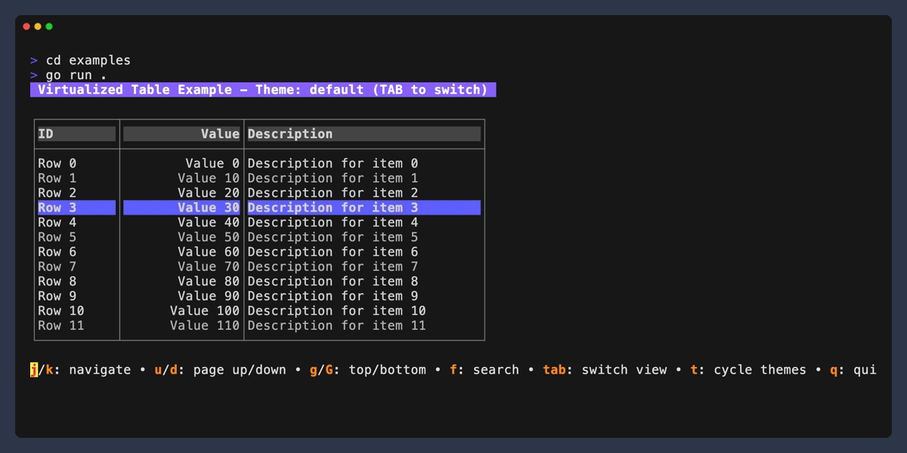

# VTable: Virtualized Components for Bubble Tea

VTable is a Go package that provides efficient virtualized scrolling components for the [Bubble Tea](https://github.com/charmbracelet/bubbletea) TUI framework. It's designed to handle large datasets with minimal memory usage by only loading and rendering the visible portion of the data.



## Features

- **Virtualized rendering** - Only loads and renders visible data, efficiently handling datasets of any size
- **Memory efficient** - Uses chunked data loading to minimize memory footprint
- **Customizable styling** - Comprehensive theming system with multiple predefined themes
- **Platform-specific keybindings** - Optimized controls for different operating systems
- **Flexible formatting** - Customize the appearance of list items and table rows
- **Seamless Bubble Tea integration** - Ready to use with the Bubble Tea TUI framework
- **Search capability** - Find and jump to specific items in large datasets
- **Threshold-based scrolling** - Smart viewport management that keeps the cursor position stable


## Components

VTable includes two main components:

1. **Virtualized List** - For displaying simple lists of items
2. **Virtualized Table** - For displaying tabular data with columns

Both components handle pagination, scrolling, and selection without loading the entire dataset into memory.

## Installation

```bash
go get github.com/davidroman0O/vtable
```

## Basic Usage

### Virtualized List

```go
package main

import (
	"fmt"
	"os"

	tea "github.com/charmbracelet/bubbletea"
	"github.com/yourusername/vtable"
)

// Simple string data provider
type StringListProvider struct {
	items []string
}

func NewStringListProvider(count int) *StringListProvider {
	items := make([]string, count)
	for i := 0; i < count; i++ {
		items[i] = fmt.Sprintf("Item %d", i)
	}
	return &StringListProvider{items: items}
}

func (p *StringListProvider) GetTotal() int {
	return len(p.items)
}

func (p *StringListProvider) GetItems(start, count int) ([]string, error) {
	if start >= len(p.items) {
		return []string{}, nil
	}

	end := start + count
	if end > len(p.items) {
		end = len(p.items)
	}

	return p.items[start:end], nil
}

func main() {
	// Configure viewport
	config := vtable.ViewportConfig{
		Height:               15,
		TopThresholdIndex:    3,
		BottomThresholdIndex: 11,
		ChunkSize:            30,
		InitialIndex:         0,
	}

	// Create data provider with 10,000 items
	provider := NewStringListProvider(10000)

	// Create list formatter
	formatter := func(item string, index int, isCursor bool, isTopThreshold bool, isBottomThreshold bool) string {
		prefix := "  "
		if isCursor {
			prefix = "> "
		}
		return prefix + fmt.Sprintf("%d: %s", index, item)
	}

	// Create list with default theme
	list, err := vtable.NewTeaList(config, provider, vtable.ThemeToStyleConfig(vtable.DefaultTheme()), formatter)
	if err != nil {
		fmt.Printf("Error: %v\n", err)
		os.Exit(1)
	}

	// Run the Bubble Tea program
	p := tea.NewProgram(list)
	if _, err := p.Run(); err != nil {
		fmt.Printf("Error running program: %v\n", err)
		os.Exit(1)
	}
}
```

### Virtualized Table

```go
package main

import (
	"fmt"
	"os"

	tea "github.com/charmbracelet/bubbletea"
	"github.com/yourusername/vtable"
)

// Example table data provider
type TableDataProvider struct {
	rows []vtable.TableRow
}

func NewTableDataProvider(count int) *TableDataProvider {
	rows := make([]vtable.TableRow, count)
	for i := 0; i < count; i++ {
		rows[i] = vtable.TableRow{
			Cells: []string{
				fmt.Sprintf("Row %d", i),
				fmt.Sprintf("Value %d", i*10),
				fmt.Sprintf("Description for item %d", i),
			},
		}
	}
	return &TableDataProvider{rows: rows}
}

func (p *TableDataProvider) GetTotal() int {
	return len(p.rows)
}

func (p *TableDataProvider) GetItems(start, count int) ([]vtable.TableRow, error) {
	if start >= len(p.rows) {
		return []vtable.TableRow{}, nil
	}

	end := start + count
	if end > len(p.rows) {
		end = len(p.rows)
	}

	return p.rows[start:end], nil
}

func main() {
	// Configure viewport
	config := vtable.ViewportConfig{
		Height:               15,
		TopThresholdIndex:    3,
		BottomThresholdIndex: 11,
		ChunkSize:            30,
		InitialIndex:         0,
	}

	// Create table config
	tableConfig := vtable.TableConfig{
		Columns: []vtable.TableColumn{
			{Title: "ID", Width: 10, Alignment: vtable.AlignLeft},
			{Title: "Value", Width: 15, Alignment: vtable.AlignRight},
			{Title: "Description", Width: 30, Alignment: vtable.AlignLeft},
		},
		ShowHeader:     true,
		ShowBorders:    true,
		ViewportConfig: config,
	}

	// Create data provider with 10,000 rows
	provider := NewTableDataProvider(10000)

	// Create table with dark theme
	table, err := vtable.NewTeaTable(tableConfig, provider, vtable.DarkTheme())
	if err != nil {
		fmt.Printf("Error: %v\n", err)
		os.Exit(1)
	}

	// Run the Bubble Tea program
	p := tea.NewProgram(table)
	if _, err := p.Run(); err != nil {
		fmt.Printf("Error running program: %v\n", err)
		os.Exit(1)
	}
}
```

## Styling and Theming

VTable comes with several predefined themes:

- `DefaultTheme()` - A standard gray/white theme
- `DarkTheme()` - Dark-colored theme
- `LightTheme()` - Light-colored theme
- `ColorfulTheme()` - Colorful theme with distinct colors

You can also create custom themes:

```go
myTheme := vtable.Theme{
    BorderStyle:          lipgloss.NewStyle().Foreground(lipgloss.Color("63")),
    HeaderBorderStyle:    lipgloss.NewStyle().Foreground(lipgloss.Color("63")),
    HeaderStyle:          lipgloss.NewStyle().Bold(true).Foreground(lipgloss.Color("15")).Background(lipgloss.Color("57")),
    RowStyle:             lipgloss.NewStyle().Foreground(lipgloss.Color("252")),
    RowEvenStyle:         lipgloss.NewStyle().Foreground(lipgloss.Color("252")),
    RowOddStyle:          lipgloss.NewStyle().Foreground(lipgloss.Color("245")),
    SelectedRowStyle:     lipgloss.NewStyle().Bold(true).Foreground(lipgloss.Color("15")).Background(lipgloss.Color("63")),
    BorderChars:          vtable.RoundedBorderCharacters(),
}
```

Border styles include:
- `DefaultBorderCharacters()`
- `RoundedBorderCharacters()`
- `ThickBorderCharacters()`
- `DoubleBorderCharacters()`
- `AsciiBoxCharacters()`

## Keybindings

VTable automatically configures platform-specific key bindings for different operating systems:

### Default Keys (all platforms)
- **Up/Down**: Navigate items
- **g/G**: Go to start/end
- **u/b**: Page up
- **d/space**: Page down
- **f/slash/**: Search
- **Enter**: Select
- **Esc/q**: Back/quit

## Architecture

### Data Provider Interface

VTable uses a data provider interface to fetch data efficiently:

```go
type DataProvider[T any] interface {
    // GetTotal returns the total number of items in the dataset
    GetTotal() int
    
    // GetItems returns a slice of items in the specified range
    GetItems(start, count int) ([]T, error)
}

// For searchable data sources
type SearchableDataProvider[T any] interface {
    DataProvider[T]
    
    // FindItemIndex searches for an item based on the given criteria
    FindItemIndex(key string, value any) (int, bool)
}
```

### Viewport Management

VTable manages the viewport with a threshold-based approach:
- The cursor stays fixed within thresholds (top and bottom threshold rows)
- When the cursor reaches a threshold, the viewport scrolls to keep the cursor at the threshold

## Advanced Usage

### Search Functionality

To enable search, implement the `SearchableDataProvider` interface:

```go
func (p *MyDataProvider) FindItemIndex(key string, value any) (int, bool) {
    // Implement search logic here
    // Return the index of the found item and true if found
    // Return -1 and false if not found
}
```

Then use it with:

```go
// Jump to an item with a specific value
found := list.JumpToItem("id", 42)
```

## Full Example

See the `examples` directory for complete working examples of both list and table components.

## Contributing

Contributions are welcome! Please feel free to submit a Pull Request.

## License

[MIT License](LICENSE) 