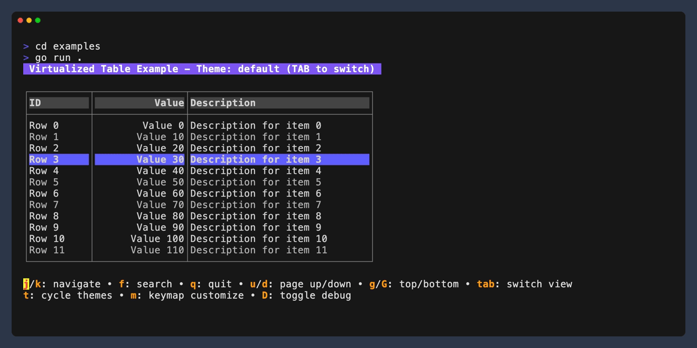

# vtable

<p align="center">
  
</p>

<p align="center">
  <a href="https://pkg.go.dev/github.com/davidroman0O/vtable"></a>
  <a href="https://goreportcard.com/report/github.com/davidroman0O/vtable"></a>
  <a href="https://github.com/davidroman0O/vtable/blob/main/LICENSE"></a>
  
</p>

A high-performance, virtualized table and list component for [Bubble Tea](https://github.com/charmbracelet/bubbletea) terminal UIs. Handle large datasets with ease while maintaining smooth performance and responsive interfaces.

## ✨ Features

- **Virtualized rendering** - Efficiently displays thousands of rows with minimal memory footprint
- **Flexible data binding** - Bring your own data provider with built-in sorting and filtering
- **Multi-column sorting** - Sort by multiple columns with visual indicators (↑/↓)
- **Advanced filtering** - Apply multiple filters simultaneously
- **Responsive navigation** - Intuitive keyboard controls with platform-specific bindings
- **Beautiful theming** - Multiple built-in themes with full customization support
- **Live customization** - Change appearance and behavior at runtime
- **Rich event system** - Detailed callbacks for selection, highlighting, scrolling, and more
- **Debug visualization** - Inspect internal state for easier development and debugging

## 📦 Installation

```bash
go get github.com/davidroman0O/vtable
```

## 🚀 Quick Start

### Table Component

```go
package main

import (
	"fmt"

	tea "github.com/charmbracelet/bubbletea"
	"github.com/davidroman0O/vtable"
)

func main() {
	// 1. Define table columns
	config := vtable.DefaultTableConfig()
	config.Columns = []vtable.TableColumn{
		{Title: "ID", Width: 5, Alignment: vtable.AlignRight, Field: "id"},
		{Title: "Name", Width: 20, Alignment: vtable.AlignLeft, Field: "name"},
		{Title: "Age", Width: 5, Alignment: vtable.AlignRight, Field: "age"},
	}

	// 2. Create data provider with your data
	provider := NewPersonProvider() 

	// 3. Create and run the table component
	table, _ := vtable.NewTeaTable(config, provider, vtable.ColorfulTheme())
	p := tea.NewProgram(table)
	p.Run()
}
```

### List Component

```go
// 1. Create a data provider with your items
provider := NewItemProvider()

// 2. Define configuration and formatter
config := vtable.DefaultViewportConfig()
formatter := func(item Item, index int, isCursor bool, topThreshold bool, bottomThreshold bool) string {
	if isCursor {
		return fmt.Sprintf("> %s", item.Name) // Highlight selected items
	}
	return item.Name
}

// 3. Create and run the list component
list, _ := vtable.NewTeaList(config, provider, vtable.ThemeToStyleConfig(vtable.DarkTheme()), formatter)
p := tea.NewProgram(list)
p.Run()
```

## 🧩 Core Concepts

### Virtualization

vtable only renders the visible portion of your data. This allows you to display thousands or even millions of rows with minimal memory and CPU usage.

```
┌─────────────────┐
│ Total Dataset   │   ← Only visible portion is loaded and rendered
├─────────────────┤
│                 │
│  Visible Area   │   ← User interacts with this section
│                 │
├─────────────────┤
│                 │
└─────────────────┘
```

### Data Providers

You supply data through a simple provider interface:

```go
// Implement this interface to supply data to vtable
type DataProvider[T any] interface {
	// Return total number of items (after applying filters)
	GetTotal() int
	
	// Return a slice of items for the requested range
	GetItems(request DataRequest) ([]T, error)
}
```

vtable fetches and displays only what's needed as the user scrolls, keeping memory usage constant regardless of dataset size.

## 📋 Features In Depth

### Multi-Column Sorting

Sort your data by multiple columns in different directions:

```go
// Primary sort
table.SetSort("lastName", "asc")

// Secondary sort (without clearing primary)
table.AddSort("age", "desc")

// Reset all sorting
table.ClearSort()
```

Users see sort direction with arrows in column headers: "Name ↑" or "Age ↓"

### Advanced Filtering

Apply multiple filters simultaneously:

```go
// Apply individual filters
table.SetFilter("minAge", 30)
table.SetFilter("city", "Chicago")

// Toggle filter modes
if msg.String() == "F" {
    multiFilterEnabled = !multiFilterEnabled
    // Enable UI indication of the mode
}

// Clear all filters
table.ClearFilters()
```

### Dynamic Theming

Choose from built-in themes or create your own:

```go
// Built-in themes
table.SetTheme(vtable.DefaultTheme())
table.SetTheme(vtable.DarkTheme())
table.SetTheme(vtable.LightTheme())
table.SetTheme(vtable.ColorfulTheme())

// Border styles
theme := vtable.DarkTheme()
theme.BorderChars = vtable.RoundedBorderCharacters()
// or: ThickBorderCharacters(), DoubleBorderCharacters(), AsciiBoxCharacters()
```

### Platform-Aware Keybindings

vtable automatically detects the user's operating system and provides appropriate keybindings:

```go
// Get platform-specific keybindings
keyMap := vtable.PlatformKeyMap()

// Or specify a platform
keyMap := vtable.MacOSKeyMap()    // macOS-specific keys
keyMap := vtable.LinuxKeyMap()    // Linux-specific keys
keyMap := vtable.WindowsKeyMap()  // Windows-specific keys

// Customize any keymap
keyMap.PageUp = key.NewBinding(
    key.WithKeys("u", "b"),
    key.WithHelp("u/b", "page up"),
)
table.SetKeyMap(keyMap)
```

### Interactive Key Highlighting

Highlight pressed keys in your help text for better user feedback:

```go
// In your Update method:
case tea.KeyMsg:
    // Store the key for highlighting
    activeKey = msg.String()
    
    // Set a timer to clear the highlight after 200ms
    cmds = append(cmds, tea.Tick(200*time.Millisecond, func(_ time.Time) tea.Msg {
        return KeyReleasedMsg{}
    }))
    
    // In your View method, check if each key matches the active key
    if key == activeKey {
        return highlightStyle.Render(key) // Apply highlight style
    }
    return normalStyle.Render(key)
```

### Rich Event System

Subscribe to events for interactive UIs:

```go
// Selection events
table.OnSelect(func(row vtable.TableRow, index int) {
    fmt.Println("Selected row:", index)
    // Update details panel or trigger action
})

// Cursor movement
table.OnHighlight(func(row vtable.TableRow, index int) {
    // Update preview panel while navigating
})

// Navigation events
table.OnScroll(func(state vtable.ViewportState) {
    // Update scrollbar position
})

// Filter and sort changes
table.OnFiltersChanged(func(filters map[string]any) {
    // Update filter indicators
})

table.OnSortChanged(func(field, direction string) {
    // Update sort indicators
})
```

## 🧠 Advanced Usage

### Implementing Efficient Data Providers

For best performance, implement filtering and sorting directly in your data provider:

```go
type PersonProvider struct {
	data         []Person
	filteredData []Person
	sortFields   []string
	sortDirs     []string
	filters      map[string]any
	dirty        bool
}

func (p *PersonProvider) GetTotal() int {
	p.ensureFilteredData() // Apply filters and sort
	return len(p.filteredData)
}

func (p *PersonProvider) GetItems(request vtable.DataRequest) ([]vtable.TableRow, error) {
	// Update provider state from request
	changed := p.applyRequestState(request)
	if changed {
		p.dirty = true
	}
	
	// Ensure filtered data is up to date
	p.ensureFilteredData()
	
	// Return only the requested chunk
	start := request.Start
	end := min(start+request.Count, len(p.filteredData))
	
	rows := make([]vtable.TableRow, end-start)
	for i := 0; i < end-start; i++ {
		person := p.filteredData[start+i]
		rows[i] = vtable.TableRow{
			Cells: []string{
				fmt.Sprintf("%d", person.ID),
				person.Name,
				fmt.Sprintf("%d", person.Age),
			},
		}
	}
	
	return rows, nil
}

func (p *PersonProvider) ensureFilteredData() {
	if !p.dirty && p.filteredData != nil {
		return // Use cached result if nothing changed
	}
	
	// Filter data
	filtered := make([]Person, 0)
	for _, person := range p.data {
		if p.matchesFilters(person) {
			filtered = append(filtered, person)
		}
	}
	
	// Sort data if needed
	if len(p.sortFields) > 0 {
		p.sortData(filtered)
	}
	
	p.filteredData = filtered
	p.dirty = false
}

// Implement filter and sort logic...
```

### Master-Detail Views

Create interactive master-detail layouts:

```go
func (m *Model) Init() tea.Cmd {
	// Set up the master-detail relationship
	m.table.OnHighlight(func(row vtable.TableRow, index int) {
		// Update the detail view with data from the selected row
		id, _ := strconv.Atoi(row.Cells[0])
		m.detailView.SetItem(m.dataProvider.GetItemByID(id))
	})
	
	return nil
}

func (m *Model) View() string {
	return lipgloss.JoinHorizontal(
		lipgloss.Top,
		m.table.View(), // Master view (table)
		m.detailView.View(), // Detail view
	)
}
```

### Dynamic Columns

Add, remove, or resize columns at runtime:

```go
// Add or remove columns dynamically
newColumns := append(
	table.GetConfig().Columns, 
	vtable.TableColumn{Title: "New Col", Width: 10},
)
table.SetColumns(newColumns)

// Toggle column visibility
func toggleColumn(columnIndex int) {
	columns := table.GetConfig().Columns
	
	if columnIndex < len(columns) {
		// Save old columns
		oldColumns := make([]vtable.TableColumn, len(columns))
		copy(oldColumns, columns)
		
		// Create new columns without the toggled column
		newColumns := append(
			oldColumns[:columnIndex],
			oldColumns[columnIndex+1:]...,
		)
		
		table.SetColumns(newColumns)
	}
}
```

## 📚 API Reference

### Components

| Component | Description |
|-----------|-------------|
| `TeaTable` | Virtualized table with columns, headers, and borders |
| `TeaList<T>` | Generic virtualized list with custom data types |

### Configuration

| Config | Description |
|--------|-------------|
| `TableConfig` | Configure columns, headers, borders, and viewport settings |
| `ViewportConfig` | Configure viewport height, thresholds, and chunk size |
| `Theme` | Configure colors, styles, and border characters |

### Navigation Methods

| Method | Description |
|--------|-------------|
| `MoveUp()`, `MoveDown()` | Move cursor one position |
| `PageUp()`, `PageDown()` | Move cursor one page |
| `JumpToStart()`, `JumpToEnd()` | Jump to first/last item |
| `JumpToIndex(int)` | Jump to specific index |
| `JumpToItem(key, value)` | Search and jump to item by property |

### Sorting and Filtering

| Method | Description |
|--------|-------------|
| `SetSort(field, direction)` | Set primary sort criteria |
| `AddSort(field, direction)` | Add secondary sort criteria |
| `RemoveSort(field)` | Remove specific sort |
| `ClearSort()` | Remove all sorting |
| `SetFilter(field, value)` | Apply filter criteria |
| `RemoveFilter(field)` | Remove specific filter |
| `ClearFilters()` | Remove all filters |

### Event Callbacks

| Method | Description |
|--------|-------------|
| `OnSelect(func(item, index))` | Called when an item is selected |
| `OnHighlight(func(item, index))` | Called when cursor moves |
| `OnScroll(func(state))` | Called when viewport scrolls |
| `OnFiltersChanged(func(filters))` | Called when filters change |
| `OnSortChanged(func(field, direction))` | Called when sorting changes |

## 🤝 Contributing

Contributions are welcome! Check out the [issues page](https://github.com/davidroman0O/vtable/issues) for ways to contribute.

## 📜 License

[MIT License](LICENSE) 