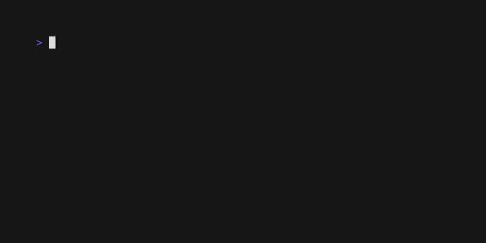

# Quick Start: Your First List

Let's get your first VTable component running. In this guide, you'll build a simple, scrollable list that handles data virtualization right out of the box.

## What You'll Build

You will create a basic list that displays 10 items, is navigable with keyboard arrows, and efficiently renders only what's on screen.



## Step 1: Set Up the Example

First, navigate to the `hello-world` example directory. This contains all the code you need to get started.

```bash
cd docs/01-getting-started/examples/hello-world
```

## Step 2: Run the Application

Execute the `main.go` file to run the application:

```bash
go run main.go
```

You should now see the list in your terminal.
**Try it:** Use the up/down arrow keys or `j`/`k` to navigate. Press `q` to quit.

## How It Works: Code Breakdown

Let's break down the key parts of `main.go` to understand how this works.

### The DataSource

The `DataSource` is where your data comes from. It's a simple struct that holds your items and implements two key methods for VTable:

```go
// SimpleDataSource provides basic string data
type SimpleDataSource struct {
	items []string // Your actual data
}

// GetTotal returns the total number of items
func (ds *SimpleDataSource) GetTotal() tea.Cmd {
	return func() tea.Msg {
		return core.DataTotalMsg{Total: len(ds.items)}
	}
}

// LoadChunk loads a specific range of items for the viewport
func (ds *SimpleDataSource) LoadChunk(request core.DataRequest) tea.Cmd {
	// ... implementation to return a chunk of data
}
```

### The List Component

Creating the list is simple. You provide a configuration and your data source.

```go
// Create list configuration
listConfig := config.DefaultListConfig()
listConfig.ViewportConfig.Height = 5 // Show 5 items at a time

// Create the list
vtableList := list.NewList(listConfig, dataSource)
```

### Navigation Handling

You handle keyboard input and send commands to VTable to control movement.

```go
// In your app's Update method:
switch msg.String() {
case "up", "k":
    // Move cursor up
    return app, core.CursorUpCmd()
case "down", "j":
    // Move cursor down
    return app, core.CursorDownCmd()
}
```
VTable receives these commands and automatically handles the complex logic of scrolling the viewport and requesting new data chunks.

## Key Takeaways

Even in this simple example, you've already achieved a lot:

-   ✅ **Virtual Rendering**: Only 5 items are rendered, regardless of the total dataset size.
-   ✅ **Efficient Memory**: Memory usage is constant because only visible items are loaded.
-   ✅ **Keyboard Navigation**: Standard up/down and `j`/`k` navigation works out of the box.
-   ✅ **Responsive Scrolling**: The list feels smooth and responsive.

## What's Next?

This basic list is the foundation for all other VTable components. Now that you've seen it in action, let's dive deeper into the core concept that makes it all possible: Data Virtualization.

**Next:** [Data Virtualization →](../02-core-concepts/01-data-virtualization.md) 