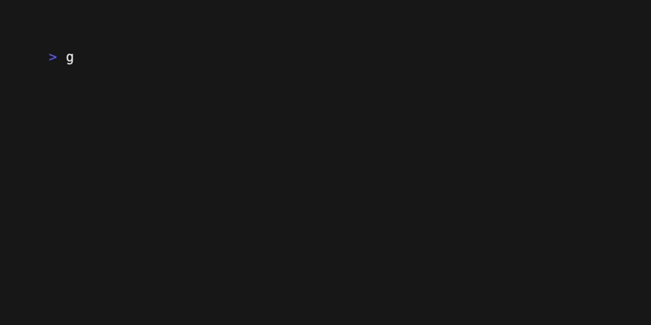

# The List Component: Basic Usage

Let's build your first VTable **List**. The List component is a powerful, data-virtualized list that can display thousands of items with high performance. We'll start with the simplest possible implementation.

## What You'll Build

A basic, scrollable list that displays a set of items and allows for keyboard navigation.



This simple example already includes core VTable features:
-   **Data virtualization**: Only visible items are loaded and rendered.
-   **Smooth navigation**: Arrow keys and j/k work immediately.
-   **Memory efficiency**: Constant memory usage, regardless of dataset size.

## Step 1: The `DataSource`

First, you need a data source. For this basic example, we'll create a simple one that holds a slice of strings.

```go
import (
	"fmt"
	tea "github.com/charmbracelet/bubbletea"
	"github.com/davidroman0O/vtable/core"
)

type SimpleDataSource struct {
	items []string
}

func (ds *SimpleDataSource) GetTotal() tea.Cmd {
	return func() tea.Msg {
		return core.DataTotalMsg{Total: len(ds.items)}
	}
}

func (ds *SimpleDataSource) LoadChunk(request core.DataRequest) tea.Cmd {
	return func() tea.Msg {
		var chunkItems []core.Data[any]
		end := request.Start + request.Count
		if end > len(ds.items) {
			end = len(ds.items)
		}

		for i := request.Start; i < end; i++ {
			chunkItems = append(chunkItems, core.Data[any]{
				ID:   fmt.Sprintf("item-%d", i), // Stable, unique ID
				Item: ds.items[i],
			})
		}
		return core.DataChunkLoadedMsg{
			StartIndex: request.Start,
			Items:      chunkItems,
			Request:    request,
		}
	}
}

// Required selection methods (not used in this basic example)
func (ds *SimpleDataSource) SetSelected(index int, selected bool) tea.Cmd { return nil }
func (ds *SimpleDataSource) GetItemID(item any) string { return fmt.Sprintf("%v", item) }
// ... other selection methods returning nil ...
```

## Step 2: Create the List Component

Now, let's create the `List` component itself. We'll use the default configuration provided by the `config` package.

```go
import (
	"github.com/davidroman0O/vtable/config"
	"github.com/davidroman0O/vtable/list"
)

func createList() *list.List {
	// Your data
	dataSource := &SimpleDataSource{
		items: []string{"Item 1", "Item 2", "Item 3", "Item 4", "Item 5", "Item 6", "Item 7", "Item 8", "Item 9", "Item 10"},
	}

	// Use default list configuration
	listConfig := config.DefaultListConfig()
	listConfig.ViewportConfig.Height = 5 // Show 5 items at a time

	// Create the list
	return list.NewList(listConfig, dataSource)
}
```

## Step 3: Integrate with Bubble Tea

Finally, integrate the `List` into your Bubble Tea application.

```go
type App struct {
	list *list.List
}

func (app *App) Init() tea.Cmd {
	// Initialize the list component
	return app.list.Init()
}

func (app *App) Update(msg tea.Msg) (tea.Model, tea.Cmd) {
	switch msg := msg.(type) {
	case tea.KeyMsg:
		switch msg.String() {
		case "q", "ctrl+c":
			return app, tea.Quit
		case "up", "k":
			return app, core.CursorUpCmd()
		case "down", "j":
			return app, core.CursorDownCmd()
		}
	}

	// Pass all other messages to the list component
	var cmd tea.Cmd
	_, cmd = app.list.Update(msg)
	return app, cmd
}

func (app *App) View() string {
	return app.list.View()
}
```

## Complete Example

A full, runnable example is available in the documentation examples directory:
[`docs/03-list-component/examples/basic-list/`](examples/basic-list/)

To run it:
```bash
cd docs/03-list-component/examples/basic-list
go run main.go
```

## Try It Yourself

-   **Change the viewport size**: Modify `listConfig.ViewportConfig.Height` to show more or fewer items at once.
-   **Increase the dataset**: Generate 1,000 items in your `SimpleDataSource` and see that the performance remains just as fast.
-   **Use your own data types**: Replace the simple `string` slice with a slice of your own custom structs.

## What's Next?

This basic list is your foundation. Next, we'll enhance the user experience by adding more powerful navigation options like page up/down and jumping to the start or end of the list.

**Next:** [Navigation and Keys →](02-navigation-and-keys.md) 