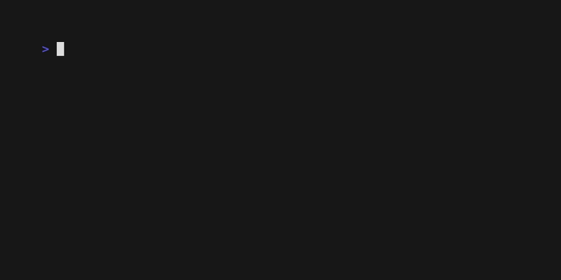

# The List Component: Navigation and Keys

Now that you have a basic list, let's enhance it with more powerful navigation. VTable provides a full suite of commands for page-based movement and jumping to the ends of your list, making it easy to navigate large datasets quickly.

## What We're Adding

Taking our "Item 1, Item 2, Item 3..." list and adding:
- **Page navigation**: Page Up/Down to jump by viewport size
- **Jump navigation**: Home/End to go to first/last item
- **More key options**: Additional key bindings for better UX



## Key Changes

## Step 1: Add More Navigation Commands

The only change required is in your application's `Update` method. You simply need to map more keys to the corresponding commands from the `core` package.

```go
func (app *App) Update(msg tea.Msg) (tea.Model, tea.Cmd) {
	switch msg := msg.(type) {
	case tea.KeyMsg:
		switch msg.String() {
		case "q", "ctrl+c":
			return app, tea.Quit

		// Basic movement (from previous guide)
		case "up", "k":
			return app, core.CursorUpCmd()
		case "down", "j":
			return app, core.CursorDownCmd()

		// NEW: Page navigation
		case "pgup", "h":
			return app, core.PageUpCmd()
		case "pgdown", "l":
			return app, core.PageDownCmd()

		// NEW: Jump navigation
		case "home", "g":
			return app, core.JumpToStartCmd()
		case "end", "G":
			return app, core.JumpToEndCmd()
		}
	}

	// Pass all other messages to the list component
	var cmd tea.Cmd
	_, cmd = app.list.Update(msg)
	return app, cmd
}
```

That's it! VTable handles the rest.

## The Navigation Commands

#### Page Movement
-   `core.PageUpCmd()`: Moves the cursor up by one viewport height.
-   `core.PageDownCmd()`: Moves the cursor down by one viewport height.

This is perfect for quickly scanning through a long list without having to press the arrow keys repeatedly.

#### Jump Movement
-   `core.JumpToStartCmd()`: Instantly moves the cursor to the first item (index 0).
-   `core.JumpToEndCmd()`: Instantly moves the cursor to the very last item.

These commands are essential for power users who need to navigate to the boundaries of a large dataset immediately.

## Keybinding Philosophy

The example uses a common keybinding pattern that caters to a wide range of users:

| Action         | Standard Keys   | Alternative (vi-style) |
| :------------- | :-------------- | :--------------------- |
| **Up/Down**    | `↑` / `↓`       | `k` / `j`              |
| **Page Up/Down** | `PgUp` / `PgDn` | `h` / `l`              |
| **Jump**       | `Home` / `End`  | `g` / `G`              |

By providing both standard and `vi`-style keys, you make your application more accessible and efficient for a broader audience.

## What You'll Experience

With a list of 50 items and a viewport height of 8, you can now:
1.  **Press `l` (or `PgDn`)**: Jump forward 8 items at a time.
2.  **Press `G` (or `End`)**: Instantly jump from the top to the very last item.
3.  **Press `g` (or `Home`)**: Instantly jump back to the first item.

The viewport will follow your navigation smoothly, loading new data chunks automatically as needed.

## Complete Example

See the full working code for this guide in the examples directory:
[`docs/03-list-component/examples/enhanced-navigation/`](examples/enhanced-navigation/)

To run it:
```bash
cd docs/03-list-component/examples/enhanced-navigation
go run main.go
```

## What's Next?

Your list now has professional-grade navigation! The next logical step is to allow users to interact with the items. We'll add the ability to select and deselect items using the spacebar.

**Next:** [Basic Selection →](03-basic-selection.md) 