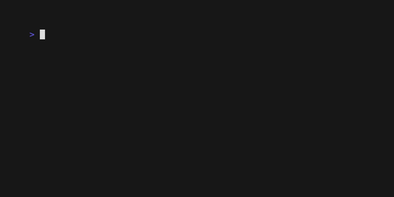

# The List Component: Basic Selection

Now that your list has great navigation, let's add the ability for users to select items. We'll start by implementing a simple toggle selection using the spacebar.

## What You'll Build

We will enhance our list to support item selection, providing clear visual feedback when an item is chosen.



*(Note: The visual style of a "selected" item depends on the theme, but it will be distinct from the cursor.)*

## How Selection Works in VTable

Selection state is owned and managed by your `DataSource`. This is a key architectural decision that keeps the `List` component stateless and flexible.

The process is simple:
1.  The user presses a key (e.g., `spacebar`).
2.  Your app sends a `core.SelectCurrentCmd()` to the `List`.
3.  The `List` component identifies the current item and tells the `DataSource` to update its selection state.
4.  The `DataSource` updates its internal state and sends back a `core.SelectionResponseMsg`.
5.  The `List` receives the response and automatically refreshes the view to show the new selection style.

## Step 1: Enable Selection in the List

First, you need to tell the `List` component to allow selection. You do this in the `ListConfig`.

```go
listConfig := config.DefaultListConfig()
listConfig.SelectionMode = core.SelectionMultiple // Or SelectionSingle
```

-   `core.SelectionMultiple`: Allows selecting multiple items.
-   `core.SelectionSingle`: Allows only one item to be selected at a time.
-   `core.SelectionNone`: Disables selection completely.

## Step 2: Add Selection Key Handling

In your app's `Update` method, map a key to the selection command.

```go
func (app *App) Update(msg tea.Msg) (tea.Model, tea.Cmd) {
	switch msg := msg.(type) {
	case tea.KeyMsg:
		switch msg.String() {
		// ... existing navigation keys ...

		// NEW: Selection command
		case " ": // Spacebar
			return app, core.SelectCurrentCmd()
		}
	}
	// ... rest of the update method ...
}
```

## Step 3: Implement Selection in the `DataSource`

This is the most important part. Your `DataSource` must now track which items are selected and handle the update requests from the `List`.

#### 3a. Add Selection State to `DataSource`
```go
type SimpleDataSource struct {
	items    []string
	selected map[int]bool // NEW: Track selected items by index
}

func NewSimpleDataSource() *SimpleDataSource {
    // ...
    return &SimpleDataSource{
        items:    //...
        selected: make(map[int]bool), // Initialize the map
    }
}
```

#### 3b. Implement the `SetSelected` Method
This method handles the actual state change.

```go
func (ds *SimpleDataSource) SetSelected(index int, selected bool) tea.Cmd {
	return func() tea.Msg {
		// Bounds checking
		if index < 0 || index >= len(ds.items) {
			return core.SelectionResponseMsg{Success: false, Error: fmt.Errorf("index out of bounds")}
		}

		// Update your internal selection state
		if selected {
			ds.selected[index] = true
		} else {
			delete(ds.selected, index)
		}

		// Return a response message to notify VTable
		return core.SelectionResponseMsg{
			Success:  true,
			Index:    index,
			Selected: selected,
		}
	}
}
```

#### 3c. Include Selection State in `LoadChunk`
Finally, when VTable requests a chunk of data, you must include the current selection state for each item.

```go
func (ds *SimpleDataSource) LoadChunk(request core.DataRequest) tea.Cmd {
	return func() tea.Msg {
		var chunkItems []core.Data[any]
		// ... loop through your items ...
		for i := request.Start; i < end; i++ {
			chunkItems = append(chunkItems, core.Data[any]{
				ID:       fmt.Sprintf("item-%d", i),
				Item:     ds.items[i],
				Selected: ds.selected[i], // NEW: Include selection state
			})
		}
		// ... return DataChunkLoadedMsg ...
	}
}
```

## What You'll Experience

1.  **Navigate** the list using the arrow keys as before.
2.  **Press the spacebar** on an item. It will change its appearance to indicate it's selected.
3.  **Press spacebar again** on the same item to deselect it.
4.  **Scroll away and back**. The item will remain selected because the state is managed by the `DataSource`.

## Complete Example

See the full working code for this guide in the examples directory:
[`docs/03-list-component/examples/basic-selection/`](examples/basic-selection/)

To run it:
```bash
cd docs/03-list-component/examples/basic-selection
go run main.go
```

## What's Next?

Our list now supports basic item selection. Next, we'll build on this by adding more powerful features like "Select All" and "Clear All" for efficient multiple selection.

**Next:** [Multiple Selection →](04-multiple-selection.md) 