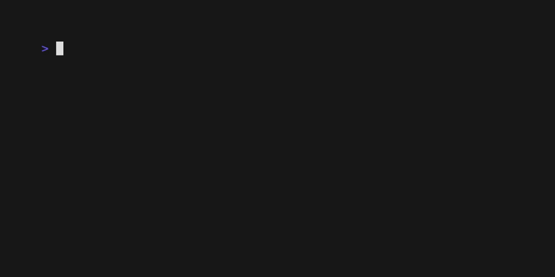

# The List Component: Multiple Selection

With basic selection working, let's add powerful multiple selection features. This guide will show you how to implement "Select All" and "Clear All" functionality, and how to display the current selection count to the user.

## What You'll Build

We'll enhance our list with bulk selection commands and a status bar to provide feedback.




## Step 1: Add Multiple Selection Commands

In your app's `Update` method, add key mappings for `SelectAllCmd` and `SelectClearCmd`.

```go
func (app *App) Update(msg tea.Msg) (tea.Model, tea.Cmd) {
	switch msg := msg.(type) {
	case tea.KeyMsg:
		switch msg.String() {
		// ... existing navigation and basic selection keys ...

		// NEW: Multiple selection commands
		case "ctrl+a":
			return app, core.SelectAllCmd()
		case "ctrl+d":
			return app, core.SelectClearCmd()
		}
	}
	// ... rest of update method ...
}
```

## Step 2: Implement Bulk Operations in `DataSource`

Your `DataSource` must implement the `SelectAll` and `ClearSelection` methods.

#### 2a. Implement `SelectAll`
This method should mark all items in your dataset as selected.

```go
func (ds *SimpleDataSource) SelectAll() tea.Cmd {
	return func() tea.Msg {
		// Iterate through all your items and set their state to selected.
		for i := 0; i < len(ds.items); i++ {
			ds.selected[i] = true
		}
		// Return a response message to notify VTable.
		return core.SelectionResponseMsg{Success: true, Operation: "selectAll"}
	}
}
```

#### 2b. Implement `ClearSelection`
This method should clear all selections.

```go
func (ds *SimpleDataSource) ClearSelection() tea.Cmd {
	return func() tea.Msg {
		// Simply re-initialize the selection map to clear it.
		ds.selected = make(map[int]bool)
		return core.SelectionResponseMsg{Success: true, Operation: "clear"}
	}
}
```

## Step 3: Track and Display Selection Count

To give the user feedback, your app should track the number of selected items and display it.

#### 3a. Add State to Your App Model
```go
type App struct {
	list           *list.List
	dataSource     *SimpleDataSource // Keep a reference to the DataSource
	selectionCount int
	statusMessage  string
}
```

#### 3b. Add a Counter Method to `DataSource`
It's good practice for the `DataSource` to be the source of truth for the selection count.

```go
func (ds *SimpleDataSource) GetSelectedCount() int {
	return len(ds.selected)
}
```

#### 3c. Handle Selection Responses
In your app's `Update` method, listen for `SelectionResponseMsg` to know when to update the count.

```go
func (app *App) Update(msg tea.Msg) (tea.Model, tea.Cmd) {
	switch msg := msg.(type) {
	// ... key handling ...

	// NEW: Handle selection responses to update the UI
	case core.SelectionResponseMsg:
		if msg.Success {
			// Update the count and status message
			app.selectionCount = app.dataSource.GetSelectedCount()
			app.statusMessage = fmt.Sprintf("%d items selected", app.selectionCount)
		}
		// Always pass the message on to the list component
		var cmd tea.Cmd
		_, cmd = app.list.Update(msg)
		return app, cmd
	}
	// ...
}
```

#### 3d. Display the Status in `View`
```go
func (app *App) View() string {
	return fmt.Sprintf(
		"Multiple Selection List\n\n%s\n\n%s\n%s",
		app.list.View(),
		"Navigate: ... | Multi: Ctrl+A/D",
		app.statusMessage, // Display the dynamic status message
	)
}
```

## What You'll Experience

1.  **Press `ctrl+a`**: All 50 items in the list will become selected instantly, and the status will update to "50 items selected".
2.  **Press `ctrl+d`**: All selections will be cleared, and the status will update to "0 items selected".
3.  **Mix operations**: You can select a few items individually with the spacebar, then press `ctrl+a` to select the rest.

## Complete Example

See the full working code for this guide in the examples directory:
[`docs/03-list-component/examples/multiple-selection/`](examples/multiple-selection/)

To run it:
```bash
cd docs/03-list-component/examples/multiple-selection
go run main.go
```

## What's Next?

Our list now has powerful selection capabilities! However, it's still just displaying simple strings. Next, we'll learn how to work with structured data and create custom-formatted list items.

**Next:** [Formatting Items →](05-formatting-items.md) 