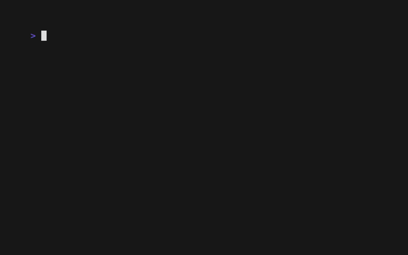

# The List Component: Checkbox Lists

Let's take our styled list and turn it into a functional checkbox list. This is a perfect example of how VTable's component-based rendering system allows for powerful customization with minimal code changes.

## What You'll Build

We will add visual `[ ]` and `[x]` indicators to our list, which will automatically update based on the selection state of each item.



## How It Works: The Enumerator Component

VTable renders each list item by combining several components. One of these is the **Enumerator**.

`[Cursor] [Enumerator] [Content]`

The enumerator is responsible for rendering the prefix for each item. By default, it's empty, but VTable provides several built-in enumerators, including one for checkboxes.

When you enable the `CheckboxEnumerator`, it automatically:
1.  Checks the `item.Selected` state for each row.
2.  Renders `☑` if `true`.
3.  Renders `☐` if `false`.

## Step 1: Enable the Checkbox Enumerator

Instead of writing a complex formatter that handles checkbox logic, you can simply tell VTable to use its built-in checkbox enumerator. This is done via a convenience method on the `List` object.

```go
// In your main function, after creating the list:
vtableList := list.NewList(listConfig, dataSource)

// NEW: Set the list to use a checklist style.
vtableList.SetChecklistStyle()
```

This single line of code tells the list's renderer to use the `list.CheckboxEnumerator` for the enumerator component.

## Step 2: Keep Your Content Formatter Clean

Because the enumerator handles the checkbox, your `styledPersonFormatter` can focus solely on rendering the content. This is a key benefit of the component system—separation of concerns.

Your formatter remains the same as in the previous styling guide. It doesn't need to know anything about checkboxes.

```go
func styledPersonFormatter(
    data core.Data[any],
    // ...
) string {
	person := data.Item.(Person)
	// ... all your existing styling logic for name, age, job ...

	// The formatter ONLY returns the person's information.
	// NO checkbox logic here!
	return fmt.Sprintf("%s %s - %s in %s",
		styledName, styledAge, styledJob, styledCity)
}
```

## Step 3: Ensure Your `DataSource` Handles Selection

Your `DataSource` implementation from the previous selection guides is all you need. The `CheckboxEnumerator` automatically uses the `item.Selected` boolean you provide in `LoadChunk`.

```go
func (ds *PersonDataSource) LoadChunk(request core.DataRequest) tea.Cmd {
	return func() tea.Msg {
		// ...
		for i := request.Start; i < end; i++ {
			items = append(items, core.Data[any]{
				// ...
				Selected: ds.selected[i], // The CheckboxEnumerator reads this value!
			})
		}
		// ...
	}
}
```

## What You'll Experience

-   **Automatic Checkboxes**: The list now displays `[ ]` or `[x]` next to each item.
-   **Interactive Toggling**: When you press the spacebar, the checkbox next to the item instantly toggles.
-   **Clean Code**: Your content formatter remains clean and focused, while the enumerator handles the checkbox logic automatically.

## Complete Example

See the full working code for this guide in the examples directory:
[`docs/03-list-component/examples/checkbox-list/`](examples/checkbox-list/)

To run it:
```bash
cd docs/03-list-component/examples/checkbox-list
go run main.go
```

## What's Next?

You've seen how easy it is to create a checkbox list using VTable's built-in enumerators. Next, we'll dive deeper into the enumerator system and learn how to create custom numbered lists.

**Next:** [Numbered Lists →](08-numbered-lists.md) 