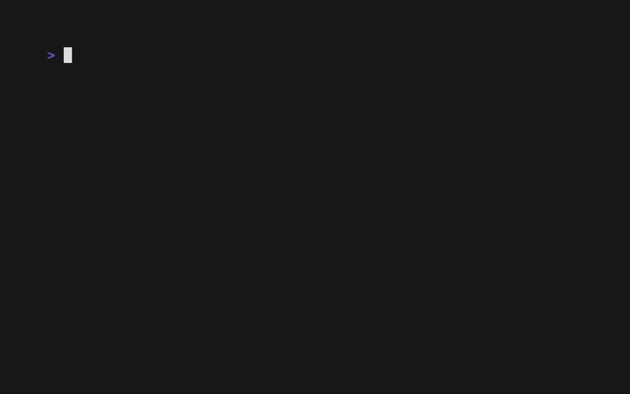

# The List Component: Numbered Lists

Let's explore VTable's **Enumerator System** in more detail by creating numbered lists. You'll learn how to use the built-in numbered style and how to create your own custom enumerator functions for complete control over item prefixes.

## What You'll Build

We will transform our styled list to display numbers, custom prefixes, and even dynamic, data-aware enumerators.



**Numbered List:**
```
 1. ► Alice Johnson...
 2.   Bob Chen...
 3.   Carol Rodriguez...
```

**Custom Enumerator:**
```
[1] ► Alice Johnson...
[2]   Bob Chen...
[3]   Carol Rodriguez...
```

**Smart Enumerator:**
```
✓ ► Alice Johnson... (Selected)
2.    Bob Chen...
3.    Carol Rodriguez...
```

## How the Enumerator System Works

As we learned with checkboxes, VTable renders each list item using a component pipeline: `[Cursor][Enumerator][Content]`.

The **Enumerator** component is responsible for the prefix of each item. By swapping out the enumerator function, you can change the list's style from bullets to numbers to anything you can imagine, without ever touching your content formatter.

## Step 1: Using the Built-in Numbered Style

The easiest way to create a numbered list is with the `SetNumberedStyle()` convenience method.

```go
// In your main function:
vtableList := list.NewList(listConfig, dataSource)

// This single line sets up the ArabicEnumerator, right-alignment,
// and appropriate spacing for a clean numbered list.
vtableList.SetNumberedStyle()
```
This is the recommended approach for standard numbered lists.

## Step 2: Creating Custom Enumerator Functions

For more control, you can write your own enumerator function. An enumerator is any function that matches the `core.ListEnumerator` signature.

```go
// The signature for a ListEnumerator function.
type ListEnumerator func(item core.Data[any], index int, ctx core.RenderContext) string
```

#### Example 1: Custom Bracket Enumerator
```go
// Displays numbers like: [1], [2], [3]
func customBracketEnumerator(item core.Data[any], index int, ctx core.RenderContext) string {
	return fmt.Sprintf("[%d] ", index+1)
}
```

#### Example 2: Smart Enumerator
This enumerator changes its output based on the item's selection state.

```go
// Displays a checkmark for selected items, otherwise a number.
func smartEnumerator(item core.Data[any], index int, ctx core.RenderContext) string {
	if item.Selected {
		return "✓ "
	}
	return fmt.Sprintf("%d. ", index+1)
}
```

#### Example 3: Data-Aware Enumerator
This enumerator inspects the item's data to change its output.

```go
// Displays an emoji based on the person's job.
func jobAwareEnumerator(item core.Data[any], index int, ctx core.RenderContext) string {
	person := item.Item.(Person) // Type-assert to access data
	if strings.Contains(person.Job, "Manager") {
		return "👑 "
	} else if strings.Contains(person.Job, "Engineer") {
		return "⚙️ "
	}
	return "• " // Default to a bullet
}
```

## Step 3: Applying a Custom Enumerator

To use a custom enumerator, you modify the list's `RenderConfig`.

```go
// 1. Get the current render configuration from the list.
renderConfig := vtableList.GetRenderConfig()

// 2. Set your custom function as the enumerator.
renderConfig.EnumeratorConfig.Enumerator = customBracketEnumerator

// 3. Configure alignment and width for a clean look.
renderConfig.EnumeratorConfig.Alignment = core.ListAlignmentRight
renderConfig.EnumeratorConfig.MaxWidth = 5 // Ensures numbers like [9] and [10] align correctly.

// 4. Apply the updated configuration back to the list.
vtableList.SetRenderConfig(renderConfig)
```

## What You'll Experience

-   **Flexibility**: Easily switch between different list styles (bullets, numbers, custom) at runtime.
-   **Separation of Concerns**: Your content formatting logic remains completely separate from your item prefix logic.
-   **Dynamic Prefixes**: Create enumerators that react to data changes, selection state, or any other condition.

## Complete Example

See the full working code, which includes an interactive demo for cycling through different enumerator styles.
[`docs/03-list-component/examples/numbered-list/`](examples/numbered-list/)

To run it:
```bash
cd docs/03-list-component/examples/numbered-list
go run main.go
```
Press the `e` key in the running application to cycle through the different enumerator styles.

## What's Next?

You now have a deep understanding of VTable's enumerator system. The next logical step is to explore the full component rendering pipeline and learn how to rearrange components to create entirely new layouts.

**Next:** [Component Rendering →](09-component-rendering.md)