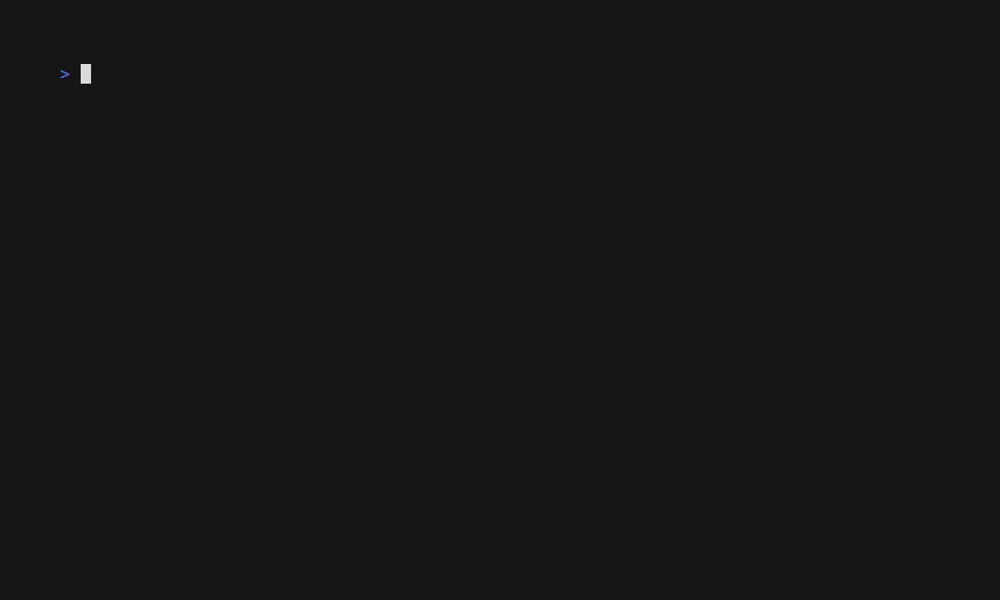

# The List Component: Component Rendering

VTable renders each list item using a flexible **component pipeline**. This system allows you to control the layout and appearance of your list by arranging and configuring individual visual components.

## What You'll Build

You will learn how to manipulate the rendering pipeline to create different list layouts, such as moving the item number to the end or creating an indented, spaced-out view.



**Default Layout:**
`►  1. Alice Johnson...`

**Custom Layouts:**
```
// Numbers at the end
► Alice Johnson...  1.

// Spaced-out layout
  ►  1. Alice Johnson...

// Content-only (minimal)
Alice Johnson...
```

## How It Works: The Component Pipeline

Every list item is constructed by combining the output of several components in a specific order. The default order is:
`[Cursor] [Enumerator] [Content]`

-   `ListComponentCursor`: Renders the cursor indicator (`►`) or spacing.
-   `ListComponentEnumerator`: Renders the item prefix (e.g., `1.`, `•`, `[x]`).
-   `ListComponentContent`: Renders your actual formatted data.

VTable also provides optional spacing components:
-   `ListComponentPreSpacing`: Adds a configurable space before all other components.
-   `ListComponentPostSpacing`: Adds a configurable space after all other components.

By changing the `ComponentOrder` in the `ListRenderConfig`, you can create completely new layouts.

## Step 1: Changing Component Order

Let's move the enumerator to the end of the line.

```go
// 1. Get the list's current render configuration.
renderConfig := vtableList.GetRenderConfig()

// 2. Change the ComponentOrder slice.
renderConfig.ComponentOrder = []core.ListComponentType{
	core.ListComponentCursor,
	core.ListComponentContent,     // Content now comes before Enumerator
	core.ListComponentEnumerator,
}

// 3. Apply the updated configuration.
vtableList.SetRenderConfig(renderConfig)
```
This simple change rearranges the rendered output without altering the underlying components or data.

## Step 2: Adding Spacing Components

To add horizontal spacing, you need to enable the spacing components and include them in the `ComponentOrder`.

```go
// 1. Get the render configuration.
renderConfig := vtableList.GetRenderConfig()

// 2. Enable and configure the spacing components.
renderConfig.PreSpacingConfig.Enabled = true
renderConfig.PreSpacingConfig.Spacing = "  "  // 2 spaces before

renderConfig.PostSpacingConfig.Enabled = true
renderConfig.PostSpacingConfig.Spacing = " "   // 1 space after

// 3. Add them to the component order.
renderConfig.ComponentOrder = []core.ListComponentType{
	core.ListComponentPreSpacing,
	core.ListComponentCursor,
	core.ListComponentEnumerator,
	core.ListComponentContent,
	core.ListComponentPostSpacing,
}

// 4. Apply the updated configuration.
vtableList.SetRenderConfig(renderConfig)
```

## Step 3: Creating Practical Layouts

By combining component order and configuration, you can create many standard layouts.

#### Minimal Content-Only Layout
```go
renderConfig.ComponentOrder = []core.ListComponentType{
	core.ListComponentContent,
}
// You might also want to disable other components for clarity:
renderConfig.CursorConfig.Enabled = false
renderConfig.EnumeratorConfig.Enabled = false
vtableList.SetRenderConfig(renderConfig)
```

#### Custom Cursor Symbol
```go
renderConfig.CursorConfig.CursorIndicator = "🔥 "
vtableList.SetRenderConfig(renderConfig)
```

## What You'll Experience

-   **Total Layout Control**: You can place any component in any order.
-   **Reusable Components**: The same `Enumerator` or `Content` component works in any layout.
-   **Dynamic Updates**: Change the layout at runtime in response to user actions or application state.

## Complete Example

See the full working code, which includes an interactive demo for cycling through different layouts and adjusting component widths.
[`docs/03-list-component/examples/component-rendering/`](examples/component-rendering/)

To run it:
```bash
cd docs/03-list-component/examples/component-rendering
go run main.go
```
-   Press `c` to cycle through different component layouts.
-   Press `w` to select a component and `+`/`-` to adjust its width.

## What's Next?

You have now mastered the visual presentation of the list component. The final step is to learn how to add server-side style filtering and sorting capabilities.

**Next:** [Filtering and Sorting →](10-filtering-sorting.md) 