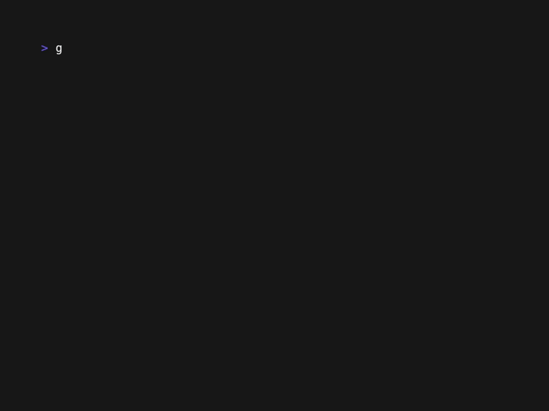

# The Tree Component: Cascading Selection

A key feature for any tree view is **cascading selection**. This is the intuitive behavior where selecting a parent node (a folder) automatically selects all of its children and grandchildren. This guide will show you how to enable this feature with a single line of configuration.

## What You'll Build

We will take our basic file tree and enable cascading selection. When you select a folder, all its contents will be instantly selected as well, providing clear visual feedback.



This is essential for operations like "delete folder," "move folder," or applying permissions to an entire directory structure.

## How It Works

Cascading selection is a built-in feature of the `TreeList` component. When enabled:
1.  You send a `core.SelectCurrentCmd()` for a parent node.
2.  The `TreeList` component receives the command.
3.  It identifies the node and all of its descendants in the tree hierarchy.
4.  It issues selection requests for the parent *and all its children* to the `DataSource`.
5.  The view refreshes, showing the entire branch as selected.

## Step 1: Enable Cascading Selection

This powerful feature is controlled by a single boolean flag in your `TreeConfig`.

```go
// In your main function:
treeConfig := tree.DefaultTreeConfig()

// Enable cascading selection. That's it!
treeConfig.CascadingSelection = true
```

**Prerequisite:** Your `ListConfig` must have `SelectionMode` set to `core.SelectionMultiple`, as cascading selection inherently requires selecting more than one item.

```go
listConfig := core.ListConfig{
    // ...
    SelectionMode: core.SelectionMultiple, // REQUIRED
}
```

## Step 2: Ensure Visual Feedback

For cascading selection to be useful, users must *see* what has been selected. We'll use the same custom formatter from the previous guide, which applies a background color to selected items.

```go
func fileTreeFormatter(item core.Data[any], /* ... */) string {
	if flatItem, ok := item.Item.(tree.FlatTreeItem[FileItem]); ok {
		content := flatItem.Item.String()

		// This style will now be applied to the parent AND all children.
		if item.Selected {
			return lipgloss.NewStyle().
				Background(lipgloss.Color("12")). // Blue background
				Foreground(lipgloss.Color("15")). // White text
				Render(content)
		}
		return content
	}
	return fmt.Sprintf("%v", item.Item)
}
```

## Step 3: Track and Display the Selection Count

To make the effect of cascading selection obvious, let's display the total number of selected items in the UI.

```go
// In your app's View method:
func (app *App) View() string {
    // Get the current selection count from the tree component.
	selectionCount := app.tree.GetSelectionCount()
	selectionInfo := fmt.Sprintf("Selected: %d items", selectionCount)

    // ... display selectionInfo ...
}
```
When you select a folder, you will see this count jump, confirming that all descendants were selected.

## What You'll Experience

1.  **Navigate** to a folder with children (e.g., `src`).
2.  **Press spacebar**. The folder itself and all files and subfolders within it will instantly change their appearance to the "selected" style.
3.  **Watch the count**: The "Selected items" counter will increase by the total number of nodes in that branch.
4.  **Deselect**: Press spacebar again on the parent folder to deselect the entire branch.

## Complete Example

See the full working code for this guide in the examples directory:
[`docs/04-tree-component/examples/cascading-selection/`](examples/cascading-selection/)

To run it:
```bash
cd docs/04-tree-component/examples/cascading-selection
go run main.go
```

## What's Next?

You've now implemented a core feature of powerful tree interfaces. Next, let's customize the visual markers of the tree itself by changing the expand and collapse symbols.

**Next:** [Tree Symbols →](03-tree-symbols.md) 