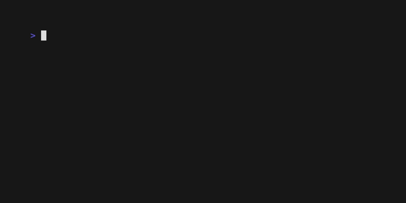

# The Tree Component: Custom Symbols

Let's customize the visual markers of our tree. VTable's **Tree Symbol Component** gives you full control over the `▼`, `▶`, and `•` symbols that indicate a node's state (expanded, collapsed, or leaf). This allows you to match the tree's appearance to your application's style.

## What You'll Build

We will take our file tree and cycle through several common symbol styles, from classic plus/minus signs to modern Unicode icons.



**Default Style:**
`► 📁 Folder`

**Plus/Minus Style:**
`+ 📁 Folder`

**Boxed Style:**
`[+] 📁 Folder`

**Emoji Style:**
`📁 📁 Folder` (using folder emoji as the symbol)

## How It Works: The `TreeSymbolConfig`

The appearance of tree symbols is controlled by the `TreeSymbolConfig` within your `TreeRenderConfig`.

```go
// Get the tree's render configuration
renderConfig := myTree.GetRenderConfig()

// Access the symbol configuration
symbolConfig := &renderConfig.TreeSymbolConfig

// Customize the symbols
symbolConfig.ExpandedSymbol  = "[-]"
symbolConfig.CollapsedSymbol = "[+]"
symbolConfig.LeafSymbol      = "   " // 3 spaces for alignment
symbolConfig.Style = lipgloss.NewStyle().Foreground(lipgloss.Color("12"))

// Apply the changes
myTree.SetRenderConfig(renderConfig)
```

## Key `TreeSymbolConfig` Properties

-   `ExpandedSymbol`: The string shown for an expanded node (default: `▼`).
-   `CollapsedSymbol`: The string shown for a collapsed node (default: `▶`).
-   `LeafSymbol`: The string shown for a node with no children (default: `•`).
-   `SymbolSpacing`: A string (usually a space) added after the symbol for padding.
-   `Style`: A `lipgloss.Style` to apply color and text formatting to the symbols.
-   `Enabled`: A boolean to show or hide the symbol component entirely.
-   `ShowForLeaves`: A boolean to control whether the `LeafSymbol` is rendered for items without children.

## Step 1: Switch to Plus/Minus Symbols

This is a classic style used in many file explorers.

```go
// Get the config
renderConfig := myTree.GetRenderConfig()

// Set the symbols
renderConfig.TreeSymbolConfig.ExpandedSymbol = "-"
renderConfig.TreeSymbolConfig.CollapsedSymbol = "+"
renderConfig.TreeSymbolConfig.LeafSymbol = " " // Use a space for files
renderConfig.TreeSymbolConfig.SymbolSpacing = " "

// Apply the config
myTree.SetRenderConfig(renderConfig)
```

**Result:**
```
- 📁 Web Application
  + 📁 src
+ 📁 CLI Tool
  📄 README.md
```

## Step 2: Create a Minimalist View

For a cleaner look, you can hide symbols for leaf nodes or disable them entirely.

#### Hide Symbols for Files
```go
renderConfig.TreeSymbolConfig.ShowForLeaves = false
```
**Result:** `📄 README.md` will no longer have a `•` or space prefix.

#### Hide All Symbols
```go
renderConfig.TreeSymbolConfig.Enabled = false
```
**Result:** A clean, indented list without any expand/collapse indicators. This relies purely on indentation to show hierarchy.

## Step 3: Use Custom Unicode and Emoji Symbols

You can use any string for the symbols, including modern Unicode characters and emojis.

```go
// Modern geometric style
renderConfig.TreeSymbolConfig.ExpandedSymbol = "◢"
renderConfig.TreeSymbolConfig.CollapsedSymbol = "◤"
renderConfig.TreeSymbolConfig.LeafSymbol = "◦"

// Emoji folder style
renderConfig.TreeSymbolConfig.ExpandedSymbol = "📂"
renderConfig.TreeSymbolConfig.CollapsedSymbol = "📁"
renderConfig.TreeSymbolConfig.LeafSymbol = "📄"
```

## What You'll Experience

-   **Complete Control**: You can define any string or icon for each node state.
-   **Visual Themes**: Create distinct visual themes for your tree (e.g., "retro", "modern", "minimalist").
-   **Improved UX**: Well-chosen symbols make the tree more intuitive to navigate.

## Complete Example

See the full working code, which includes an interactive demo for cycling through different symbol themes.
[`docs/04-tree-component/examples/tree-symbols/`](examples/tree-symbols/)

To run it:
```bash
cd docs/04-tree-component/examples/tree-symbols
go run main.go
```
Press the `s` key in the running application to cycle through the different symbol styles.

## What's Next?

You can now fully customize the symbols in your tree. The next logical step is to style the rest of the tree, including the content, cursor, and selection highlights.

**Next:** [Tree Styling →](04-tree-styling.md) 