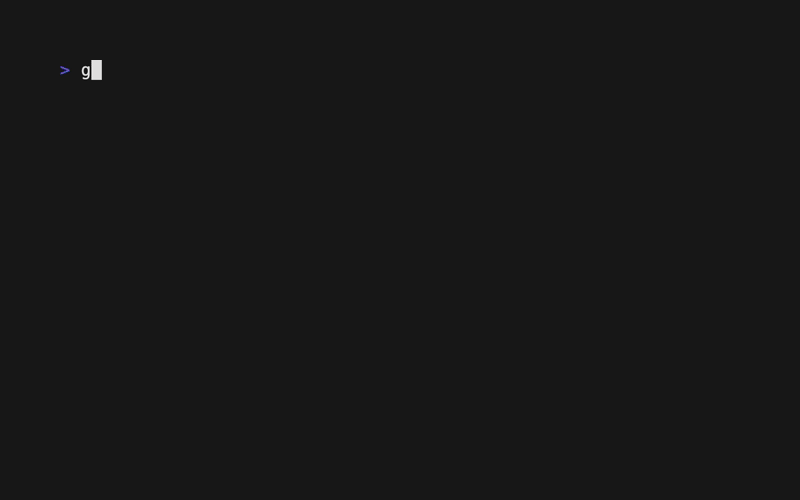

# The Tree Component: Styling and Themes

With custom symbols in place, let's bring our tree to life with **styling and themes**. This guide will show you how to use `lipgloss` to control colors, fonts, and backgrounds, creating a polished and visually appealing tree interface.

## What You'll Build

We will create several distinct visual themes for our file tree and add the ability to cycle through them dynamically. You will learn to style every aspect of the tree, from content and symbols to the cursor and selection states.



**Default Theme:**
```
► 📁 Web Application
    📄 main.go
```

**Dark Theme:**
```
// Example with different colors and a full-row cursor
► 📁 Web Application
    📄 main.go
```

**Professional Theme:**
```
// Example with a more subdued, professional color palette
► 📁 Web Application
    📄 main.go
```

## How Styling Works in VTable

Tree styling is managed through the `TreeRenderConfig`, which allows you to configure the `lipgloss.Style` for each component of the tree.

-   `ContentConfig.Formatter`: The primary way to style the item's text content.
-   `TreeSymbolConfig.Style`: Styles the expand/collapse/leaf symbols.
-   `BackgroundConfig.Style`: Controls the cursor highlight.
-   `IndentationConfig.Style`: Styles the indentation strings or connector lines.

By combining these, you can create comprehensive themes.

## Step 1: Create a Themed Content Formatter

The most powerful way to style content is through a custom formatter. The formatter can apply different styles based on the item's data (e.g., folder vs. file) and state (e.g., selected, cursor).

```go
import "github.com/charmbracelet/lipgloss"

// A formatter for a "professional" theme
func createProfessionalThemeFormatter() func(...) string {
	return func(item core.Data[any], ...) string {
		if flatItem, ok := item.Item.(tree.FlatTreeItem[FileItem]); ok {
			content := flatItem.Item.String()

			// 1. Selection style always has the highest priority.
			if item.Selected {
				return lipgloss.NewStyle().
					Background(lipgloss.Color("153")). // Soft blue
					Foreground(lipgloss.Color("0")).   // Black text
					Render(content)
			}

			// 2. Apply folder/file styling for unselected items.
			if flatItem.Item.IsFolder {
				return lipgloss.NewStyle().
					Foreground(lipgloss.Color("24")). // Dark blue for folders
					Bold(true).
					Render(content)
			} else {
				return lipgloss.NewStyle().
					Foreground(lipgloss.Color("240")). // Dark gray for files
					Render(content)
			}
		}
		return fmt.Sprintf("%v", item.Item)
	}
}
```

## Step 2: Configure the Cursor Style

The cursor is styled using the `TreeBackgroundComponent`. You can configure it to highlight just the content or the entire row.

#### Content-Only Cursor (Default)
This highlights only the item's text content.

```go
// Get the tree's render configuration
renderConfig := myTree.GetRenderConfig()

renderConfig.BackgroundConfig.Enabled = true
renderConfig.BackgroundConfig.Mode = tree.TreeBackgroundContentOnly
renderConfig.BackgroundConfig.Style = lipgloss.NewStyle().
    Background(lipgloss.Color("240")). // Gray background
    Foreground(lipgloss.Color("15"))   // White text
```

#### Full-Row Cursor
This highlights the entire line from edge to edge.

```go
renderConfig.BackgroundConfig.Mode = tree.TreeBackgroundEntireLine
```

The `TreeBackgroundComponent` automatically handles calculating the correct width and applying the style to the entire row.

## Step 3: Create and Apply a Full Theme

A "theme" is just a collection of configured styles. Let's create a struct to manage our themes and a function to apply them.

```go
type ThemeStyle struct {
	Name           string
	Formatter      func(...) string
	SymbolStyle    lipgloss.Style
	CursorStyle    lipgloss.Style
	BackgroundMode tree.TreeBackgroundMode
}

// Example: A dark theme definition
var darkTheme = ThemeStyle{
    Name:        "Dark",
    Formatter:   createDarkThemeFormatter(),
    SymbolStyle: lipgloss.NewStyle().Foreground(lipgloss.Color("244")).Bold(true),
    CursorStyle: lipgloss.NewStyle().Background(lipgloss.Color("235")),
    BackgroundMode: tree.TreeBackgroundEntireLine,
}

// Function to apply a theme to the tree
func (app *App) applyTheme(theme ThemeStyle) {
	renderConfig := app.tree.GetRenderConfig()

	// Apply styles from the theme
	renderConfig.ContentConfig.Formatter = theme.Formatter
	renderConfig.TreeSymbolConfig.Style = theme.SymbolStyle
	renderConfig.BackgroundConfig.Style = theme.CursorStyle
	renderConfig.BackgroundConfig.Mode = theme.BackgroundMode

	app.tree.SetRenderConfig(renderConfig)
}
```

## What You'll Experience

-   **Thematic Consistency**: All elements of the tree (content, symbols, cursor) will share a consistent visual style.
-   **Dynamic Themes**: You can switch between completely different looks at runtime.
-   **Clear Visual States**: Cursor and selection states are clearly differentiated through styling.

## Complete Example

See the full working code, which includes an interactive demo for cycling through multiple pre-built themes.
[`docs/04-tree-component/examples/tree-styling/`](examples/tree-styling/)

To run it:
```bash
cd docs/04-tree-component/examples/tree-styling
go run main.go
```
Press the `t` key in the running application to cycle through the different themes.

## What's Next?

You now have complete control over the visual appearance of your tree. The next step is to master the layout itself by customizing the indentation and spacing between components.

**Next:** [Tree Indentation →](05-tree-indentation.md) 