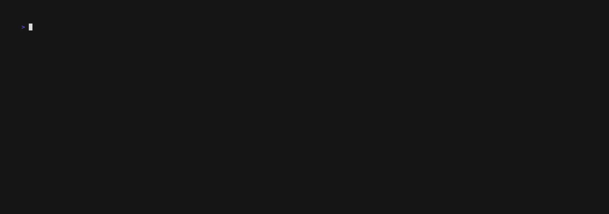

# The Table Component: Filtering and Sorting

This guide explains how to add powerful, server-side style filtering and sorting to your table. The key insight is that **VTable has built-in support for these features; you just need to implement the data manipulation logic in your `DataSource`.**



## How It Works: The `DataRequest`

Every time VTable needs a chunk of data, it calls your `DataSource.LoadChunk` method with a `DataRequest` object. This object contains the complete state of active filters and sorts.

```go
type DataRequest struct {
    Start          int
    Count          int
    SortFields     []string        // VTable automatically sends active sort fields.
    SortDirections []string        // e.g., "asc" or "desc".
    Filters        map[string]any  // VTable automatically sends active filters.
}
```
Your `DataSource` is responsible for using these parameters to return the correct slice of data.

## The Filtering and Sorting Flow

1.  **User Action**: The user presses a key (e.g., `'s'`) to sort a column.
2.  **VTable Command**: Your app sends a command like `core.SortToggleCmd("name")`.
3.  **VTable State Update**: VTable updates its internal sort state and triggers a full data refresh.
4.  **DataSource Request**: VTable calls `GetTotal()` and `LoadChunk()` with a `DataRequest` that now includes the new sorting parameters.
5.  **Your Logic**: Your `DataSource` applies the sorting (and any active filters) to your data before returning the requested chunk.
6.  **UI Update**: VTable renders the new, sorted data.

VTable manages the UI state; your `DataSource` handles the data logic.

## Step 1: Implement a `DataSource` that can Filter and Sort

Your `DataSource` needs to maintain the current filter and sort state so it can apply them to the data.

```go
type EmployeeDataSource struct {
	employees      []Employee
	filteredData   []Employee     // A cached slice of the data after filtering/sorting.
	activeFilters  map[string]any
	sortFields     []string
	sortDirections []string
}

// A central method to re-apply filters and sorts whenever they change.
func (ds *EmployeeDataSource) rebuildData() {
	// 1. Apply filters to the original dataset.
	filtered := ds.applyFilters(ds.employees, ds.activeFilters)

	// 2. Apply sorting to the filtered results.
	sorted := ds.applySorts(filtered, ds.sortFields, ds.sortDirections)

	// 3. Cache the final result.
	ds.filteredData = sorted
}
```

## Step 2: Implement the Filtering Logic

Create a helper method in your `DataSource` to apply the filters.

```go
func (ds *EmployeeDataSource) applyFilters(people []Employee, filters map[string]any) []Employee {
	if len(filters) == 0 {
		return people // Return all data if no filters are active.
	}
	var filtered []Employee
	for _, person := range people {
		if ds.matchesAllFilters(person, filters) {
			filtered = append(filtered, person)
		}
	}
	return filtered
}

// This helper checks if a single employee matches all active filters.
func (ds *EmployeeDataSource) matchesAllFilters(emp Employee, filters map[string]any) bool {
    for field, value := range filters {
        switch field {
        case "department":
            if emp.Department != value.(string) { return false }
        case "high_salary":
            if emp.Salary < 75000 { return false }
        // ... other filter conditions
        }
    }
    return true // Must pass all active filters.
}
```

## Step 3: Implement the Sorting Logic

Create a helper method to apply sorting using Go's `sort.Slice`.

```go
func (ds *EmployeeDataSource) applySorts(people []Employee, fields []string, directions []string) []Employee {
	if len(fields) == 0 {
		return people // No sorting requested.
	}
	// ... implementation using sort.Slice ...
    // See the full example for a detailed implementation.
	return sorted
}
```

## Step 4: Use VTable's Filter and Sort Commands

Your application's `Update` function does not need to manage the filter state. It simply sends commands to VTable.

```go
func (app *App) Update(msg tea.Msg) (tea.Model, tea.Cmd) {
	switch msg := msg.(type) {
	case tea.KeyMsg:
		switch msg.String() {
		// --- SORT COMMANDS ---
		case "s": // Sort by the active column
			// Your logic to get the active column's field name...
			activeField := "name"
			return app, core.SortToggleCmd(activeField)
		case "S": // Clear sorting
			return app, core.SortsClearAllCmd()

		// --- FILTER COMMANDS ---
		case "1": // Toggle a pre-configured filter
			return app, core.FilterSetCmd("department", "Engineering")
		case "0": // Clear all filters
			return app, core.FiltersClearAllCmd()
		}
	}
	// ...
}
```

## What You'll Experience

-   **Interactive Sorting**: Navigate to any column and press `s` to sort by it.
-   **Cumulative Filtering**: Press number keys to layer multiple filters (e.g., "Engineering" + "High Salary").
-   **Instant Feedback**: The table view, including the total item count and scrollbar, updates instantly to reflect the filtered and sorted data.

## Complete Example

See the full working code, which includes an interactive demo with multiple pre-configured filters and column-based sorting.
[`docs/05-table-component/examples/filtering-sorting/`](examples/filtering-sorting/)

To run it:
```bash
cd docs/05-table-component/examples/filtering-sorting
go run .
```

## What's Next?

This guide concludes the primary feature walkthrough for the `Table` component. The final guide in this series covers an essential topic for development: how to add debugging and observability features to your table to monitor its internal state and performance.

**Next:** [Debug and Observability →](12-debug-observability.md)