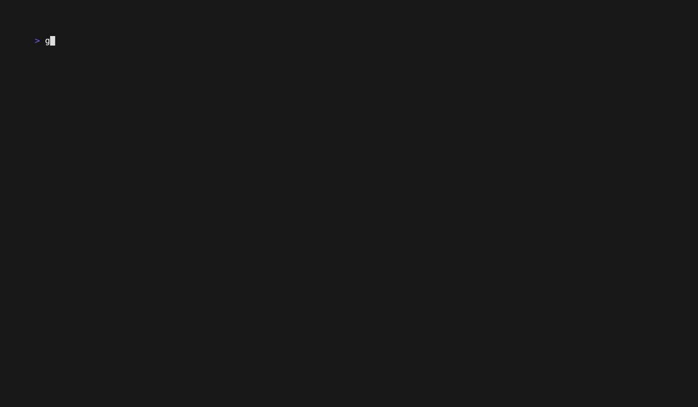

# The Table Component: Debug and Observability

This guide demonstrates how to add debugging and observability features to your VTable application. You'll learn how to monitor VTable's internal state, track performance, and log user activity without interfering with the component's core logic.

## What You'll Build

We will enhance our table with a multi-level debug view that provides real-time insights into:
-   **Activity Log**: A running log of user actions and system events.
-   **Performance Metrics**: Memory usage, operation counts, and timings.
-   **Chunk State**: The status of data chunks (loading, loaded, unloaded).
-   **Message Tracing**: A verbose log of all Bubble Tea messages being processed.



```text
// Example of the debug view enabled
=== DEBUG INFO ===
Mode: Detailed | Ops: 123 | Memory: 1.2MB | Chunks: 4

Recent Activity:
15:04:05 [user] navigation: Cursor movement
15:04:06 [system] chunk_load_start: Chunk 100 (size: 25)

Chunk States:
Chunk 75: loaded (112ms) | size: 25 | accessed: 3
Chunk 100: loading | size: 25 | accessed: 0
```

## How It Works: Non-Invasive Observation

The key to debugging VTable is to **observe its messages without interfering**. Your app's `Update` function acts as a central hub where you can inspect messages before passing them on to the table component for processing.

```go
func (m AppModel) Update(msg tea.Msg) (tea.Model, tea.Cmd) {
    // 1. Intercept any message for logging and inspection.
    m.logMessage(msg) // Your custom logging function

    switch msg := msg.(type) {
    case core.ChunkLoadingStartedMsg:
        // 2. Track specific states based on the message type.
        m.trackChunkLoading(msg)
    // ... other cases
    }

    // 3. ALWAYS pass the original message to the table.
    var cmd tea.Cmd
    _, cmd = m.table.Update(msg)
    return m, cmd
}
```
This pattern ensures that your debugging logic never breaks the table's internal operations.

## Step 1: Create a Debug System in Your App

Add state to your `AppModel` to hold the debugging information you want to track.

```go
type ActivityLog struct{ /* ... */ }
type PerformanceMetrics struct{ /* ... */ }
type ChunkState struct{ /* ... */ }

type AppModel struct {
	table      *table.Table
	// ... other app state

	// --- Debug and Observability State ---
	debugMode          int // 0=Off, 1=Basic, 2=Detailed, 3=Verbose
	activityLog        []ActivityLog
	performanceMetrics PerformanceMetrics
	chunkStates        map[int]ChunkState // Keyed by chunk start index
}
```

## Step 2: Intercept Key VTable Messages

In your `Update` function, add a `switch` statement to inspect messages before passing them to the table.

#### Track Chunk Loading
```go
case core.ChunkLoadingStartedMsg:
    m.chunkStates[msg.ChunkStart] = ChunkState{
        Status: "loading",
        LoadStartTime: time.Now(),
        // ...
    }
case core.ChunkLoadingCompletedMsg:
    if state, ok := m.chunkStates[msg.ChunkStart]; ok {
        state.Status = "loaded"
        state.LoadEndTime = time.Now()
        // ...
    }
case core.ChunkUnloadedMsg:
    if state, ok := m.chunkStates[msg.ChunkStart]; ok {
        state.Status = "unloaded"
        // ...
    }
```

#### Track User Actions
```go
case tea.KeyMsg:
    m.logActivity("user", "key_press", msg.String())

case core.SortToggleCmd:
    m.logActivity("user", "sort", "Toggled sort")
```

## Step 3: Implement Debug Controls

Add keybindings to control the debug view.

```go
// In your Update method:
case tea.KeyMsg:
    switch msg.String() {
    case "d": // Cycle through debug modes
        m.debugMode = (m.debugMode + 1) % 4
    case "D": // Toggle a persistent overlay
        m.showDebugOverlay = !m.showDebugOverlay
    case "ctrl+r": // Reset debug data
        m.resetDebugInfo()
    }
```

## Step 4: Render the Debug Information

In your `View` method, render the collected debug information based on the current `debugMode`.

```go
func (m AppModel) View() string {
	var view strings.Builder

	// 1. Render the main table interface.
	view.WriteString(m.renderMainInterface())

	// 2. Conditionally render the debug sections.
	if m.debugMode >= DebugBasic {
		view.WriteString("\n\n--- Activity Log ---\n")
		view.WriteString(m.renderActivityLog())
	}
	if m.debugMode >= DebugDetailed {
		view.WriteString("\n\n--- Chunk States ---\n")
		view.WriteString(m.renderChunkStates())
	}
	if m.showDebugOverlay {
		// ... render a compact overlay ...
	}

	return view.String()
}
```

## What You'll Experience

-   **Level 1 (Basic)**: See a live log of user actions (key presses, sorts) and high-level system events (data reloads).
-   **Level 2 (Detailed)**: See all of the above, plus detailed information on every data chunk being loaded, unloaded, and the time it took.
-   **Level 3 (Verbose)**: See a raw log of every single Bubble Tea message being processed by the application.
-   **Overlay (`D`)**: A compact, persistent status bar for at-a-glance performance monitoring.

## Complete Example

See the full working code, which includes an interactive demo for cycling through debug modes and viewing live performance data.
[`docs/05-table-component/examples/debug-observability/`](examples/debug-observability/)

To run it:
```bash
cd docs/05-table-component/examples/debug-observability
go run .
```

## What's Next?

This concludes the documentation series for VTable's primary components. You now have a comprehensive understanding of how to build performant, feature-rich, and customizable lists, trees, and tables for your terminal applications.

**Congratulations on completing the VTable guides!** 